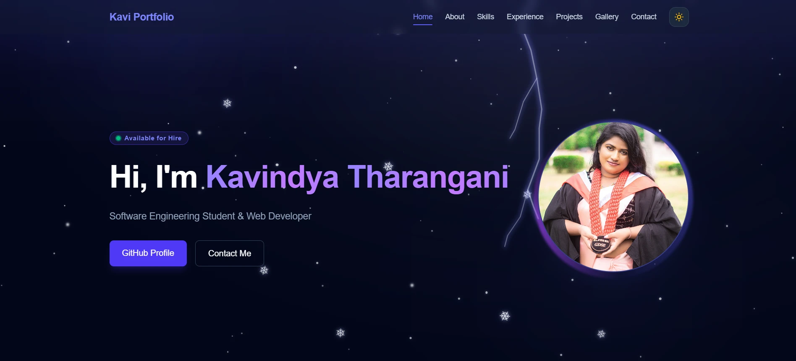

👆 Click the image to visit my portfolio

  

---

## 💫 About Me

I'm a **Software Engineering student at IJSE** and an **intern software engineer** who loves building practical, user-friendly web applications.

- 🔭 Currently building full-stack apps with **Next.js, NestJS & Spring Boot**
- 🌱 Learning **Advanced API Development** & **Computer Networking**
- 👯 Looking to collaborate on **Software Engineering** projects
- 💬 Ask me about **Java, React, TypeScript**
- 📫 Reach me at **tharanganikavi08@gmail.com**
- ⚡ Fun fact: I'm a Funny Girl 😄

 

---

## 💻 Tech Stack

**Languages**

  
  
  
  
  
  

**Frameworks & Libraries**

  
  
  
  
  
  
  

**Databases & Cloud**

  
  
  
  
  

**Tools & Design**

  
  
  
  
  
  

---

## 🚀 Featured Projects

| Project | Description | Stack |
|---|---|---|
| [🚗 AutoParts POS](https://github.com/kavitharangani/vehicle-parts-shop) | Full-stack POS & inventory system for a vehicle spare parts shop — invoicing, stock tracking, returns and reports | Next.js · Prisma · PostgreSQL |
| [💊 Pharmacy Management System](https://github.com/kavitharangani/Pharmacy_Management_System_Layered_Architecture.) | Pharmacy operations app built on a layered architecture | Java · MySQL |
| [💬 Small Chat Application](https://github.com/kavitharangani/Small_Chat_Application_Finalize) | Real-time chat app using socket programming | Java · Networking |
| [🎨 MyPortfolio Web Design](https://github.com/kavitharangani/MyPortfolio_Web_Design) | Responsive personal portfolio design | HTML · CSS · JS |

---

## 📊 GitHub Stats

  
  
   
  
    
  

## 🏆 GitHub Trophies

  

---

### ✍️ Random Dev Quote

  

### 😂 Random Dev Meme

  

---

  Thanks for visiting! ⭐ Made with 💜 by Kavindya Tharangani

